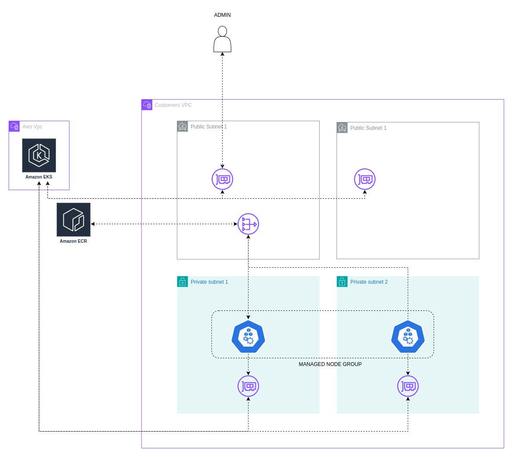

# Eks with Terraform and Terragrunt

Project holds resources for deploying production ready aws eks cluster with pre installed plugins ( [see here](#cluster-add-ons-stack) ).
Project is deployed as a terraform project with terragrunt to orchestrate the deployment and ArgoCD to deploy examples.

Project is deployed in five interdependent stack which are explained below. These are [network](#network), [eks cluster](#eks-cluster), [eks add-ons](#cluster-add-ons-stack-here), [storage](#storage) and [user access](#user-access).

## Directory Structure

Project is organized in the following way.

All infrastructure configuration is in `infrastructure/` directory.
Terraform modules for all stacks, excluding eks cluster, are in `infrastructure/modules`.

Configuration values for specific environment are in `infrastructure/_envcommon` and they need to be populated before deploying the infrastructure.

Directory `infrastructure/live` holds terragrunt configuration files for the five stacks.
Directory is organized by account and availability zone with corresponding configuration files on every level.


```bash
├── README.md
├── argocd-apps                     # ArgoCD root applications
├── assets                          # Documentation assets
├── docs                            # Documentation
├── examples                        # Examples
│   ├── apps                        # ArgoCD applications
│   ├── cert-manager
│   ├── cluster-autoscaler
│   ├── ebs-csi
│   ├── efs
│   ├── external-dns
│   ├── hpa
│   ├── lbc
│   └── nginx
├── infrastructure                  # Infrastructure
│   ├── _envcommon                  # Common variables shared between stacks
│   │   ├── accounts.hcl
│   │   ├── cluster.hcl
│   │   └── domain.hcl
│   ├── live
│   │   ├── sandbox
│   │   │   ├── account.hcl         # Account details
│   │   │   └── eu-west-1
│   │   │       ├── addons          # Add-ons stack
│   │   │       ├── eks             # Eks stack
│   │   │       ├── environment.hcl # Terragrunt environment values
│   │   │       ├── network         # Network stack
│   │   │       ├── region.hcl      # Terragrunt region information
│   │   │       ├── storage         # Storage stack
│   │   │       └── user-access     # User access stack
│   ├── modules                     # Terraform modules
│   │   ├── addons
│   │   ├── network
│   │   ├── storage
│   │   └── users-iam
│   └── terragrunt.hcl              # Root terragrunt configuration
└── services                        # Extra services
    ├── apps
    └── global
        ├── cert-manager
        ├── storage-classes
        └── users-iam
```

## Deploying The Infrastructure

### Requirements

Before starting ensure you have the following tools installed:
- terraform
- terragrunt
- aws cli

Also ensure that you have the following aws resources:
- sandbox account with deployment role
- Route 53 public hosted zone
- network account with a deployment role ( optional )
- aws user with cli permissions and permissions to assume the deployment roles

### Deploy Infrastructure

See the [deployment instructions](./docs/deployment-instructions.md)

### Deploying Examples

Examples are in `examples` directory.
Every example has an associated `README.md` that examples the example in detail.

Examples can be deployed individually or all at once with ArgoCD.
Deploy individual examples with
```bash
kubectl apply -k examples/<EXAMPLE>
```

#### Deploying Examples With ArgoCD

Examples are deployed with app of apps pattern with root application located in `argocd-apps`.
Applications for individual examples are located in `examples/apps`.

Start by retrieving initial ArgoCD password.
```bash
kubectl get secret -n argocd argocd-initial-admin-secret -o jsonpath="{.data.password}" | base64 -d
```

Forward the port to the application and go to `localhost:8080`.
```bash
kubectl port-forward -n argocd svc/argocd-server 8080:80
```

Deploy ArgoCD root applications.
```bash
kubectl apply -f argocd-apps
```

It will take a couple of minutes to scale the worker nodes to handle all of the examples.
After some time you should see all gree in web portal.


<figure>
  
  <figcaption><center>Fig 1. ArgoCD Web Portal</center></figcaption>
</figure>


## Stacks

Infrastructure is deployed in five stacks with terragrunt acting as an orchestrator.

Stacks:
- [network](#network)
- [eks cluster](#eks-cluster)
- [storage](#storage)
- [user access](#user-access)
- eks add-ons


### Network

Network stack holds networking resources for the project.
It is deployed from terraform module `infrastructure/module/network`.

#### Vpc

Two public subnets and two private subnets are deployed.
Private subnets hold eks worker nodes and endpoints for efs storage.
Public subnets hold load balancer for external access to the cluster.

One nat gateway is deployed in one of the public subnets to ensure that worker nodes can pull images from ECR.

**Network CIDR block:** 10.0.0.0/16


| **Subnet**              | **CIDR Block**                |
|---------------------|-------------------------------|
| **Private Subnet #1**   | 10.0.0.0/19                   |
| **Private Subnet #2**   | 10.0.32.0/19                  |
| **Public Subnet #1**    | 10.0.64.0/19                  |
| **Public Subnet #2**    | 10.0.96.0/19                  |

#### Dns

To allow dns resolution, new public hosted zone for the `api` subdomain ( by default ) is deployed into sandbox account.
In root hosted zone, NS record is created for the subdomain, pointing to the new hosted zone.

<center>
  <figure>
    
    <figcaption><center>Fig 2. Dns Resolution</center></figcaption>
  </figure>
</center>


### Eks Cluster

Eks cluster stack holds bare bone eks cluster deployment.
It is deployed from official aws module in terraform registry [link](https://registry.terraform.io/modules/terraform-aws-modules/eks/aws/latest).

Cluster is deployed with both public and private access allowing both administration from the internet and private access from the worker nodes.

Aws control plane is managed by aws in their vpc.
In our subnets, elastic network interfaces are deployed, with proper permissions, to allow communication between worker nodes and control plane.

Worker nodes are deployed as on demand managed node group with a pool of instance types.
For more details about the cluster configuration see `infrastructure/_envcommon/cluster.hcl`.


<center>
  <figure>
    
    <figcaption><center>Fig 3. Eks Configuration</center></figcaption>
  </figure>
</center>

### Storage

Storage stack contains efs file system with necessary resources so that it can be mounted on the worker nodes.
It is deployed from terraform module `infrastructure/module/storage`.

Module deploys efs file system and mount targets in private subnets so that worker nodes can mount the file system with efs csi driver.
It also deploys kubernetes storage class resource to the kubernetes cluster.


<center>
  <figure>
    
    <figcaption><center>Fig 4. Efs Storage</center></figcaption>
  </figure>
</center>

### User Access

User access stack contains resources needed to grand users admin and reader permissions to the eks cluster.
It is deployed from terraform module `infrastructure/users-iam`.

For admin users it create admin iam role and links it to admin cluster group using eks api.
Admin iam group is created as well with permissions to assume the admin role, to easily add new users.

For viewers it creates viewer iam role and binds it to the viewer group using eks api.
Viewer iam group is created as well with permission to assume the viewer role, to easily add new users.

In eks, permissions for admin and viewer group is granted with cluster role and cluster role binding.
They are defined in `services/users-iam` and are not deployed with the terraform resources.

To see how to add admin/viewer users, see [link](./docs/how-to-add-admin-users.md)

### Cluster Add-ons ( HERE )

Cluster is deployed with a set of controllers that are shown below.
Controllers are deployed with helm charts or if supported as a cluster add on managed by aws.

List of add-ons:
- pod identity
- metric server
- cluster autoscaler
- ebs csi driver
- efs csi controller
- load balancer controller
- cert manager
- nginx ingress controller
- external dns controller
- ArgoCD

#### Pod identity

Pod identity is one of the options for granting access to pods to access aws resources.
It is deployed as a `DaemonSet` to all the worker nodes.
Before using, check if it is applicable for your case in aws documentation.

Pod identity is deployed as a eks add-on with the latest version at the time of writing the project.
To update the version find out the latest version of the add-on and update the module parametar value.

Find out pod identity add-on version.
```bash
aws eks describe-addon-versions --region eu-west-1 --addon-name eks-pod-identity-agent
```

#### Metric Server

Metric server is a controller that is used to determine cpu and memory utilization by nodes and pods.
It is used by pod autoscaler for scaling pods horizontally or vertically.

For more advanced scaling use cases based on latency, traffic, saturation or errors substitute metric server for prometheus or keda.

Metric server is installed with helm and the latest version at the time of writing.
To upgrade the version of metric server use the command below to find out the new version and update the corresponding module parametar.

```bash
helm repo add metric-server https://kubernetes-sigs.github.io/metrics-server/
helm repo update
helm search repo metric-server/metric-server
```

To see default chart values use the command below.
```bash
helm show values metric-server/metric-server --version VERSION
```

#### Cluster Autoscaler

Controller used for scaling in/out managed worker nodes based on the cluster load.
To use cluster autoscaler metric server needs to be installed.

It uses aws autoscaling groups for scaling the worker nodes.
When managed worker nodes are created you define minimum, maximum and desired size of the worker node group.

Examples on cluster autoscaler can be found [here](./examples/cluster-autoscaler).

Cluster autoscaler is installed with helm and the latest version at the time of writing.
To upgrade the version use the command below to find out the new version and update the corresponding module parametar.

```bash
helm repo add autoscaler https://kubernetes.github.io/autoscaler
helm repo update
helm search repo autoscaler/cluster-autoscaler
```

To see default chart values use the command below.
```bash
helm show values autoscaler/cluster-autoscaler --version VERSION
```

#### Ebs Csi Driver

Controller responsible for providing the interface to aws ebs volumes.
After controller is installed you are able to provision persistent volumes backed by ebs drives directly or dynamically with persistent volume claims.

Ebs backed persistent volumes support only `ReadWriteOnce` mode and are tied to one availability zone.

Examples on ebs csi driver can be found [here](./examples/ebs-csi/).
Files in `services/storage-classes` hold custom storage classes for the cluster.

Ebs csi driver is deployed as a eks add-on with the latest version at the time of writing the project.
To update the version find out the latest version of the add-on and update the module parametar value.
```bash
aws eks describe-addon-versions --region eu-west-1 --addon-name aws-ebs-csi-driver
```

#### Efs Csi Controller

Controller responsible for mounting highly available efs volumes to the pods.
Like with ebs controller you are able to provision persistent volume objects directly or with persistent volume claims.

Controller will not allocate new efs drives, it will only mount existing drives and make it available to the pod.
Persistent volumes backed by efs support `ReadWriteMany` option.

Examples on using efs csi controller can be found [here](./examples/efs/)

Efs csi controller is installed with helm and the latest version at the time of writing.
To upgrade the version use the command below to find out the new version and update the corresponding module parametar.

```bash
helm repo add efs-csi https://kubernetes-sigs.github.io/aws-efs-csi-driver/
helm repo update
helm search repo efs-csi/aws-efs-csi-driver
```

To see default chart values use the command below.
```bash
helm show values efs-csi/aws-efs-csi-driver --version VERSION
```

#### Load Balancer Controller

Controller responsible for managing cloud resources for ingress and service objects.

When service of type `LoadBalancer` is created, controller will provision network load balancer.
For every service of type `LoadBalancer` one network load balancer is provisioned.

When ingress object is defined, controller will provision application load balancer.
To keep number of application load balancers down, define ingress groups, where every ingress group maps to one application load balancer.

Other option is to use nginx reverse proxy, deployed in the cluster, to route the traffic and network load balancers just as an entry point to the cluster ([see below](#nginx)).

Examples on load balancer controller can be found [here](./examples/lbc/)

Annotations used with network load balancer can be found [here](https://kubernetes-sigs.github.io/aws-load-balancer-controller/v2.7/guide/service/annotations/).

Annotations used with ingress can be found [here](https://kubernetes-sigs.github.io/aws-load-balancer-controller/v2.7/guide/ingress/annotations/).


Load balancer controller is installed with helm and the latest version at the time of writing.
To upgrade the version use the command below to find out the new version and update the corresponding module parametar.

```bash
helm repo add eks-charts https://aws.github.io/eks-charts
helm repo update
helm search repo eks-charts/aws-load-balancer-controller
```

To see default chart values use the command below.
```bash
helm show values eks-charts/aws-load-balancer-controller --version VERSION
```

#### Nginx

Nginx reverse proxy, deployed in the cluster, to route http/https traffic in the cluster.
Serves as an alternative way of routing traffic where traffic is passed to the reverse proxy from the load balancers and routed within a cluster.
Better solution than routing with aws load balancers since it is easier to collect telemetry from nginx then from aws.

When the nginx is deployed, network load balancer is created with the ip target group pointing to the nginx pods.
By default 80 and 443 port are forwarded.
Both public and private nginx are deployed for public and private network traffic respectfully.


Examples on external nginx can be found [here](./examples/nginx/)


Nginx ingress is installed with helm and the latest version at the time of writing.
To upgrade the version use the command below to find out the new version and update the corresponding module parametar.

```bash
helm repo add nginx https://kubernetes.github.io/ingress-nginx
helm repo update
helm search repo nginx/ingress-nginx
```

To see default chart values use the command below.
```bash
helm show values nginx/ingress-nginx --version VERSION
```


#### External DNS

External DNS controller is responsible for managing route 53 dns records from kubernetes.

When the ingress resource is created dns records are automatically updated.
When deploying service resources you can annotate them to create custom dns entries.
External dns is deployed with `sync` policy allowing it to create/delete records on resource creation/deletion.

Examples of external dns can be found [here](./examples/external-dns/)

External dns is installed with helm and the latest version at the time of writing.
To upgrade the version use the command below to find out the new version and update the corresponding module parametar.

```bash
helm repo add external-dns https://kubernetes-sigs.github.io/external-dns
helm repo update
helm search repo external-dns/external-dns
```

To see default chart values use the command below.
```bash
helm show values external-dns/external-dns --version VERSION
```

#### ArgoCD

ArgoCD is continuous deployment tool for kubernetes platform that ensures that the state of the cluster is aligned with the git repository.

Examples and extra resources are deployed with ArgoCD and app of apps pattern.
Root ArgoCD applications are in `argocd-apps`. Applications for services are in `services/apps` and applications for examples are in `examples/apps`.

ArgoCD is installed with helm and the latest version at the time of writing.
To upgrade the version use the command below to find out the new version and update the corresponding module parametar.

```bash
helm repo add argo https://argoproj.github.io/argo-helm
helm repo update
helm search repo argo/argo-cd
```

To see default chart values use the command below.
```bash
helm show values argo/argo-cd --version VERSION
```

## Cleanup
```bash
# delete services and examples
kubectl delete -f argocd-apps

# delete infrastructure
pushd ./infrastructure/live
AWS_PROFILE=developer-base terragrunt run-all destroy
popd
```
