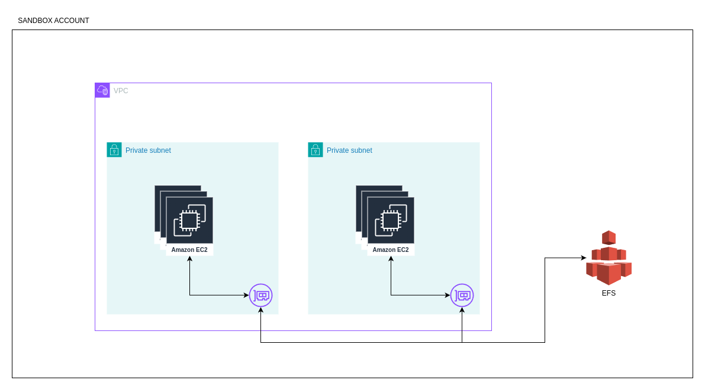

# Eks with Terraform and Terragrunt

Project holds resources for deploying production ready aws eks cluster with pre installed plugins ( [see here](#cluster-add-ons) ).
Project is deployed as a terraform project with terragrunt to orchestrate the deployment and ArgoCD to deploy examples.

Project is deployed in five interdependent stack which are explained below. These are [network](#network), [eks cluster](#eks-cluster), [eks add-ons](#cluster-add-ons), [storage](#storage) and [user access](#user-access).

## Directory Structure

Project is organized in the following way.

All infrastructure configuration is in `infrastructure/` directory.
Terraform modules for all stacks, excluding eks cluster, are in `infrastructure/modules`.

Configuration values for specific environment are in `infrastructure/_envcommon` and they need to be populated before deploying the infrastructure.

Directory `infrastructure/live` holds terragrunt configuration files for the five stacks.
Directory is organized by account and availability zone with corresponding configuration files on every level.


```bash
├── README.md
├── argocd-apps                     # ArgoCD root applications
├── assets                          # Documentation assets
├── docs                            # Documentation
├── examples                        # Examples
│   ├── apps                        # ArgoCD applications
│   ├── cert-manager
│   ├── cluster-autoscaler
│   ├── ebs-csi
│   ├── efs
│   ├── external-dns
│   ├── hpa
│   ├── lbc
│   └── nginx
├── infrastructure                  # Infrastructure
│   ├── _envcommon                  # Common variables shared between stacks
│   │   ├── accounts.hcl
│   │   ├── cluster.hcl
│   │   └── domain.hcl
│   ├── live
│   │   ├── sandbox
│   │   │   ├── account.hcl         # Account details
│   │   │   └── eu-west-1
│   │   │       ├── addons          # Add-ons stack
│   │   │       ├── eks             # Eks stack
│   │   │       ├── environment.hcl # Terragrunt environment values
│   │   │       ├── network         # Network stack
│   │   │       ├── region.hcl      # Terragrunt region information
│   │   │       ├── storage         # Storage stack
│   │   │       └── user-access     # User access stack
│   ├── modules                     # Terraform modules
│   │   ├── addons
│   │   ├── network
│   │   ├── storage
│   │   └── users-iam
│   └── terragrunt.hcl              # Root terragrunt configuration
└── services                        # Extra services
    ├── apps
    └── global
        ├── storage-classes
        └── users-iam
```

## Deploying The Infrastructure

### Requirements

Before starting ensure you have the following tools installed:
- terraform
- terragrunt
- aws cli

Also ensure that you have the following aws resources:
- sandbox account with deployment role
- Route 53 public hosted zone
- network account with a deployment role ( optional )
- aws user with cli permissions and permissions to assume the deployment roles

### Deploy Infrastructure

See the [deployment instructions](./docs/deployment-instructions.md).

### Get Permissions To Access The Cluster

Update your local `.kube/config` file to be able to use `kubectl` command.
```bash
aws eks update-kubeconfig --name demo --region eu-west-1 --profile developer-sandbox-admin
```
Test that you are able to access kubernetes cluster.
```bash
kubectl get all -A
```


## Examples

Examples are defined in `examples` directory.

List of examples:
- [cert-manager](./examples/cert-manager/README.md)
- [cluster autoscaler](./examples/cluster-autoscaler/README.md)
- [ebs csi](./examples/ebs-csi/README.md)
- [efs](./examples/efs/README.md)
- [external dns](./examples/external-dns/README.md)
- [horizontal pod autoscaler](./examples/hpa/README.md)
- [nginx ingress](./examples/nginx/README.md)


### Deploying Examples

Examples are in `examples` directory.
Every example has an associated `README.md` that examples the example.

Examples can be deployed individually or all at once with ArgoCD.
Deploy individual examples with
```bash
kubectl apply -k examples/<EXAMPLE>
```

#### Deploying Examples With ArgoCD

Examples are deployed with app of apps pattern with root application located in `argocd-apps`.
Applications for individual examples are located in `examples/apps`.

Start by retrieving initial ArgoCD password.
```bash
kubectl get secret -n argocd argocd-initial-admin-secret -o jsonpath="{.data.password}" | base64 -d
```

ArgoCD is configured to be exposed securely over public [nginx ingress](#nginx).
Make sure ArgoCD certificate is in `Ready` state.
```bash
kubectl get certificate -n argocd --watch
```

When it is ready go do `https://argocd.api.DOMAIN` and login with admin user and secret from previous step.

Deploy ArgoCD root applications.
```bash
kubectl apply -f argocd-apps
```

It will take a couple of minutes to scale the worker nodes to handle all of the examples.
After some time you should see all gree in web portal.


<figure>
  
  <figcaption><center>Fig 1. ArgoCD Web Portal</center></figcaption>
</figure>


## Stacks

Infrastructure is deployed in five stacks with terragrunt acting as an orchestrator.

Stacks:
- [network](#network)
- [eks cluster](#eks-cluster)
- [storage](#storage)
- [user access](#user-access)
- [cluster add-ons](#cluster-add-ons)


### Network

Network stack holds networking resources for the project.
It is deployed from terraform module `infrastructure/module/network`.

#### Vpc

Two public subnets and two private subnets are deployed.
Private subnets hold eks worker nodes and endpoints for efs storage.
Public subnets hold load balancer for external access to the cluster.

One nat gateway is deployed in one of the public subnets to ensure that worker nodes can pull images from ECR.

**Network CIDR block:** 10.0.0.0/16


| **Subnet**              | **CIDR Block**                |
|---------------------|-------------------------------|
| **Private Subnet #1**   | 10.0.0.0/19                   |
| **Private Subnet #2**   | 10.0.32.0/19                  |
| **Public Subnet #1**    | 10.0.64.0/19                  |
| **Public Subnet #2**    | 10.0.96.0/19                  |

#### Dns

To allow dns resolution, new public hosted zone for the `api` subdomain ( by default ) is deployed into sandbox account.
In root hosted zone, NS record is created for the subdomain, pointing to the new hosted zone.

<center>
  <figure>
    
    <figcaption><center>Fig 2. Dns Resolution</center></figcaption>
  </figure>
</center>


### Eks Cluster

Eks cluster stack holds bare bone eks cluster deployment.
It is deployed from official aws module in terraform registry [link](https://registry.terraform.io/modules/terraform-aws-modules/eks/aws/latest).

Cluster is deployed with both public and private access allowing both administration from the internet and private access from the worker nodes.

Aws control plane is managed by aws in their vpc.
In our subnets, elastic network interfaces are deployed, with proper permissions, to allow communication between worker nodes and control plane.

Worker nodes are deployed as on demand managed node group with a pool of instance types.
For more details about the cluster configuration see `infrastructure/_envcommon/cluster.hcl`.


<center>
  <figure>
    
    <figcaption><center>Fig 3. Eks Configuration</center></figcaption>
  </figure>
</center>

### Storage

Storage stack contains efs file system with necessary resources so that it can be mounted on the worker nodes.
It is deployed from terraform module `infrastructure/module/storage`.

Module deploys efs file system and mount targets in private subnets so that worker nodes can mount the file system with efs csi driver.
It also deploys kubernetes storage class resource to the kubernetes cluster.


<center>
  <figure>
    
    <figcaption><center>Fig 4. Efs Storage</center></figcaption>
  </figure>
</center>

### User Access

User access stack contains resources needed to grand users admin and reader permissions to the eks cluster.
It is deployed from terraform module `infrastructure/users-iam`.

For admin users it create admin iam role and links it to admin cluster group using eks api.
Admin iam group is created as well with permissions to assume the admin role, to easily add new users.

For viewers it creates viewer iam role and binds it to the viewer group using eks api.
Viewer iam group is created as well with permission to assume the viewer role, to easily add new users.

In eks, permissions for admin and viewer group is granted with cluster role and cluster role binding.
They are defined in `services/users-iam` and are not deployed with the terraform resources.

To see how to add admin/viewer users, see [link](./docs/how-to-add-admin-users.md)

### Cluster Add-ons

Cluster add-ons stack contains set of controllers and pre-configured kubernetes resources, that are installed in eks cluster to provide additional functionality.
It is deployed from terraform module `infrastructure/module/addons`.

List of add-ons:
- [pod identity](#pod-identity)
- [metric server](#metric-server)
- [cluster autoscaler](#cluster-autoscaler)
- [ebs csi driver](#ebs-csi-driver)
- [efs csi controller](#efs-csi-controller)
- [load balancer controller](#load-balancer-controller)
- [external dns controller](#external-dns)
- [cert manager](#cert-manager)
- [nginx ingress controller](#nginx)
- [ArgoCD](#argocd)

#### Pod identity

Pod identity is a controller that provides a mechanism for kubernetes pods to access aws resources.
It is one of the newer mechanisms that require less setup in comparison to IRSA.
It is deployed as a `DaemonSet` kubernetes resources.

Pod identity is installed as a eks add-on with the latest version at the time of writing the project.
To update the version of the add-on, find out the latest version and update the module parametar value.

To find out pod identity add-on version use the following command.
```bash
aws eks describe-addon-versions --region eu-west-1 --addon-name eks-pod-identity-agent
```

#### Metric Server

Metric server is a controller that is used to gather cpu and memory utilization by nodes and pods.
Those metrics can be used afterwards for pod and cluster autoscaling events.
For more advanced scaling use cases based on latency, traffic, saturation or errors, substitute metric server for prometheus or keda.

Metric server is installed as a helm chart with the latest version at the time of writing.
To upgrade the version of the chart, use the command below to find out the new version and update the corresponding module parametar.
```bash
helm repo add metric-server https://kubernetes-sigs.github.io/metrics-server/
helm repo update
helm search repo metric-server/metric-server
```

To see default chart values that can be overridden, use the command below.
```bash
helm show values metric-server/metric-server --version VERSION
```

#### Cluster Autoscaler

Cluster Autoscaler is a controller used for scaling managed worker nodes based on the cluster load.
It is usually one of two options used for scaling the cluster, other one being Karpenter.
To install Cluster Autoscaler, [metric server](#metric-server) needs to be installed beforehand.

Cluster Autoscaler is simpler of the two options and it uses aws autoscaling groups to scale the worker nodes.
When managed worker nodes are created, you define node types, minimum, maximum and desired size of the worker node group.

It is recommended to create separate worker node groups for different loads.
If you are deploying stateful applications backed by [ebs](#ebs-csi-driver), it is recommended to create dedicated node group tied to a single az.

Karpenter can be more cost efficient since it chooses extra worker nodes based on the load that is pending,
but it can also fall short if you have a lot of `DaemonSet` objects deployed.
Depending on your workload choose the best solution.

Cluster Autoscaler is installed as a helm chart with the latest version at the time of writing.
To upgrade the version of the chart, use the command below to find out the new version and update the corresponding module parametar.
```bash
helm repo add autoscaler https://kubernetes.github.io/autoscaler
helm repo update
helm search repo autoscaler/cluster-autoscaler
```

To see default chart values that can be overridden, use the command below.
```bash
helm show values autoscaler/cluster-autoscaler --version VERSION
```

#### Ebs Csi Driver

Ebs Csi Controller is a controller used for managing persistent volumes backed by ebs volumes.
It is able to create, delete and resize volumes using persistent volume or persistent volume claim objects.

Ebs backed persistent volumes support only `ReadWriteOnce` mode.
They are also tied to a single availability zone, and if you are building stateful application backed by ebs, consider creating dedicating worker node group tied to a single az.

Ebs csi driver is deployed as a eks add-on with the latest version at the time of writing.
To update the version, find out the latest version of the add-on and update the module parametar value.
```bash
aws eks describe-addon-versions --region eu-west-1 --addon-name aws-ebs-csi-driver
```

#### Efs Csi Controller

Efs Csi Controller is responsible for mounting highly available efs volumes to the pods.
Like with ebs controller you are able to provision persistent volume objects directly or with persistent volume claims.
But unlike [ebs controller](#ebs-csi-driver), efs controller does not provision new efs drives.
It only mounts existing one to the pods.

Efs backed storage is more expensive, but it supports `ReadWriteMany` option and is a good choice for stateless applications where pods need access to shared data.

Efs csi controller is installed as a helm chart with the latest version at the time of writing.
To upgrade the version of the chart, use the command below to find out the new version and update the corresponding module parametar.

```bash
helm repo add efs-csi https://kubernetes-sigs.github.io/aws-efs-csi-driver/
helm repo update
helm search repo efs-csi/aws-efs-csi-driver
```

To see default chart values that can be overridden, use the command below.
```bash
helm show values efs-csi/aws-efs-csi-driver --version VERSION
```

#### Load Balancer Controller

Load Balancer Controller is responsible for managing aws load balancers as an entry point for kubernetes applications.
It provisions application load balancers for ingress objects and network load balancers for services of type `LoadBalancer`.

For every service of type `LoadBalancer`, one network load balancer is provisioned.
And for every ingress object separate application load balancer is provisioned.

That can become expensive over time.
Ingress costs can be reduced with ingress groups, but can become hard to manage.

To reduce the cost usually dedicated reverse proxy, like [nginx](#nginx) is deployed in the cluster with network load balancer fronting the reverse proxy.
That way you have one or usually two (public and private) network load balancers deployed on aws.
Reverse proxy, deployed as a pod, has additional benefits of easier management with the same telemetry system that is used with other applications in the cluster.

To provision load balancer user [ingress annotations](https://kubernetes-sigs.github.io/aws-load-balancer-controller/v2.7/guide/ingress/annotations/) and [service annotations](https://kubernetes-sigs.github.io/aws-load-balancer-controller/v2.7/guide/service/annotations/).

Load balancer controller is installed as a helm chart with the latest version at the time of writing.
To upgrade the version of the chart, use the command below to find out the new version and update the corresponding module parametar.
```bash
helm repo add eks-charts https://aws.github.io/eks-charts
helm repo update
helm search repo eks-charts/aws-load-balancer-controller
```

To see default chart values that can be overridden, use the command below.
```bash
helm show values eks-charts/aws-load-balancer-controller --version VERSION
```

#### External DNS

External DNS controller is a way to simplify dns management from kubernetes.
It watches ingress and service objects and updates route 53 dns records.

When the ingress resource is created, dns records are automatically updated.
When deploying service resources you can annotate them to create custom dns entries.
External dns is deployed with `sync` policy allowing it to delete records as well when the ingress objects are deleted.

External dns is installed as a helm chart with the latest version at the time of writing.
To upgrade the version of the chart, use the command below to find out the new version and update the corresponding module parametar.
```bash
helm repo add external-dns https://kubernetes-sigs.github.io/external-dns
helm repo update
helm search repo external-dns/external-dns
```

To see default chart values that can be overridden, use the command below.
```bash
helm show values external-dns/external-dns --version VERSION
```

#### Cert-Manager

Certificate Manager Controller is a way to automate provisioning and renewal of tls certificates used by in cluster reverse proxy ([nginx](#nginx)).
That way tls termination is done on [nginx](#nginx) inside of the cluster.

Controller uses free [Let's Encrypt](https://letsencrypt.org/) certificates for encrypting the traffic.
If you prefer to have tls termination on the aws load balancer level, use [aws certificate manager](https://aws.amazon.com/certificate-manager/) to provision the certificate and inject the certificate arn into your ingress configuration.

Cluster issuer object that uses dns 01 challenges is deployed with cert-manager.
Cluster issuer is a cluster level kubernetes object used to issue the certificates.

When certificate is requested, dns record in a public hosted zone is created for [Let's Encrypt](https://letsencrypt.org/) to validate that we are the owner of the domain.
After validation is completed, certificate is issued and challenge is deleted.

Cert-manager is installed as a helm chart with the latest version at the time of writing.
To upgrade the version of the chart, use the command below to find out the new version and update the corresponding module parametar.
```bash
helm repo add cert-manager https://charts.jetstack.io
helm repo update
helm search repo cert-manager/cert-manager
```

To see default chart values that can be overridden, use the command below.
```bash
helm show values cert-manager/cert-manager --version VERSION
```

#### Nginx

Nginx is an application deployed in the cluster that acts as a reverse proxy.
That is it routes incoming traffic to specific pods inside of the cluster.
Serves as an alternative way of routing traffic where traffic is passed to the reverse proxy from the load balancers and routed within a cluster.

Having reverse proxy in the cluster is usually cheaper since you have only one or two load balancer deployed on aws that act as an entry point for all applications.
It is also easier to collect telemetry data since reverse proxy is pod in the cluster.

Two nginx controllers are deployed, one for public and one for private traffic.
Every nginx controller is fronted by layer 4 aws network load balancer which forwards the traffic to nginx pods.
Two ingress class objects are created in the cluster, `external-nginx` and `internal-nginx`, for public and private ingress objects respectively.

By default 80 and 443 port are forwarded.


Nginx ingress is installed as a helm chart with the latest version at the time of writing.
To upgrade the version of the chart, use the command below to find out the new version and update the corresponding module parametar.
```bash
helm repo add nginx https://kubernetes.github.io/ingress-nginx
helm repo update
helm search repo nginx/ingress-nginx
```

To see default chart values that can be overridden, use the command below.
```bash
helm show values nginx/ingress-nginx --version VERSION
```

#### ArgoCD

ArgoCD is one of the applications for deploying kubernetes resources.
It watches the repository of manifests and synchronizes the state of the repository with the state of the cluster.
That way repository is the single source of truth for your kubernetes cluster.

It is preferred way of deploying kubernetes resources in comparison to using `kubectl` from outside of the cluster.
Since it is deployed in the kubernetes cluster it has more information on how the application is doing and can flag it as healthy or unhealthily.

It is also improvement from security standpoint since it is a pulling model where you don't have to share credentials for kubernetes cluster with CICD platforms.
You manage access by managing git repository access.


Examples can be deployed with application of applications pattern where one ArgoCD root application deploys all other applications which in turn deploy resources.
That way you deploy only one root application manually and the rest is deployed automatically.

<figure>
  
  <figcaption><center>Fig 5. ArgoCD Web Portal</center></figcaption>
</figure>

ArgoCD root applications are in `argocd-apps` directory.
Applications for the examples are in `examples/apps` directory.

ArgoCD is exposed with public [nginx ingress](#nginx) and traffic is secured with [cert-manager](#cert-manager).
ArgoCD web portal can be accessed on `https://argocd.api.DOMAIN`.


ArgoCD is installed as a helm chart with the latest version at the time of writing.
To upgrade the version of the chart, use the command below to find out the new version and update the corresponding module parametar.
```bash
helm repo add argo https://argoproj.github.io/argo-helm
helm repo update
helm search repo argo/argo-cd
```

To see default chart values that can be overridden, use the command below.
```bash
helm show values argo/argo-cd --version VERSION
```


## Cleanup
If you deployed examples individually, make sure you delete the resources to release all of the aws resources.
```bash
kubectl delete -k examples/EXAMPLE
```

If you deployed examples with [ArgoCD](#argocd), make sure to delete root ArgoCD for the same reason.
```bash
kubectl delete -f argocd-apps
```

Delete the infrastructure.
```bash
pushd ./infrastructure/live
AWS_PROFILE=developer-base terragrunt run-all destroy
popd
```
