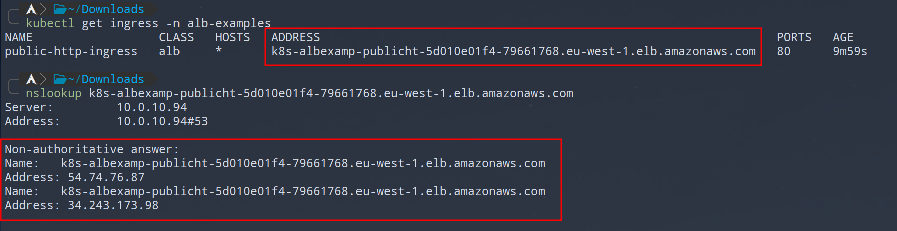

# Application Load Balancer Examples

Deploy examples with `kubectl apply -f .`.
Wait a couple of minutes for load balancer to get ready.
All examples are deployed in `alb-examples` namespace.

## Public http traffic

Non encrypted public access with layer 7 load balancer.
Load balancer is provisioned with ingress object using `ip` target type, routing traffic directly to pod ip addresses.

Get ingress public address and check that it is resolving ok.

Check that you can access the service in web browser or using `curl <address>`.
