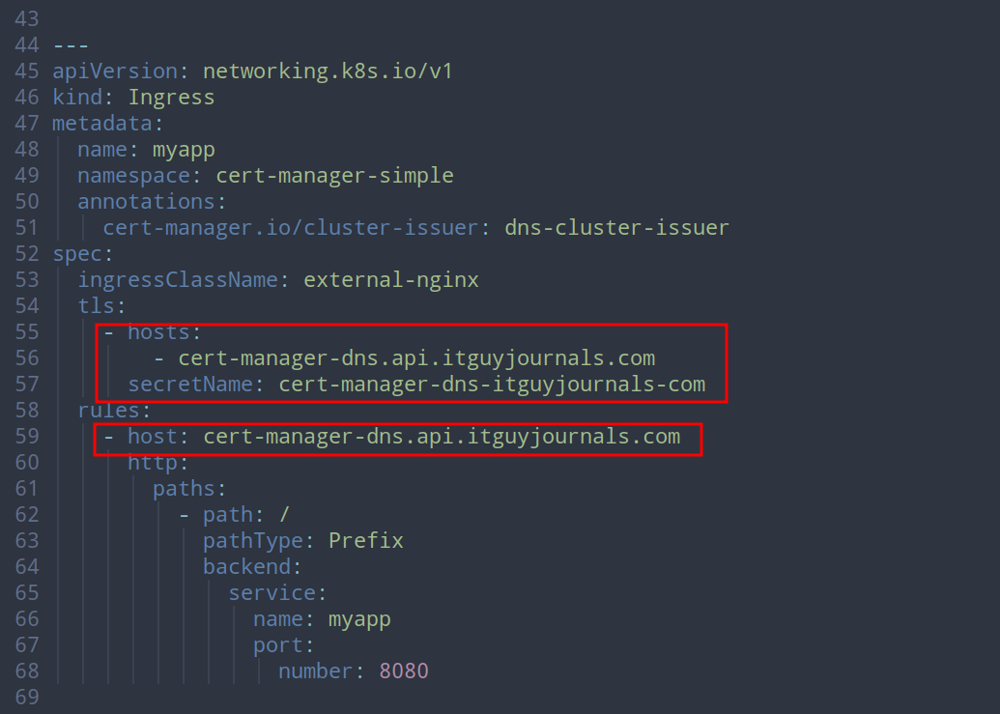
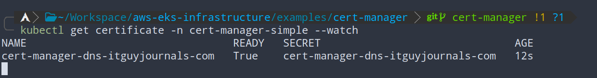

# Cert Manager

Examples with automatic certificate provisioning using cert-manager.
For more informatio see [link](/README.md#cert-manager)

## Simple

Simple example demonstrating provisioning of the certificate from Let's Encrypt.

Change tls configuration for the ingress to match your domain.



Wait for a couple of minutes until certificate is ready.

```bash
# get certificate
kubectl get certificate -n cert-manager-example

# get details about the certificate
kubectl describe certificate -n cert-manager-example

# describe certificate request
kubectl describe CertificateRequest -n cert-manager-example

# describe order that is created by certificate request
kubectl describe Order -n cert-manager-example

# describe challenge that is created by the order
kubectl describe Challenge -n cert-manager-example
```


<p align="center">
    
</p>
<p align="center">
    <em>Fig. Cert-manager simple example</em>
</p>

