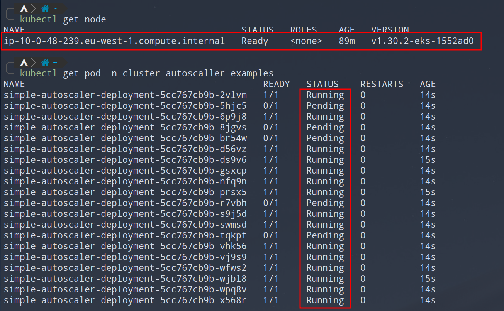
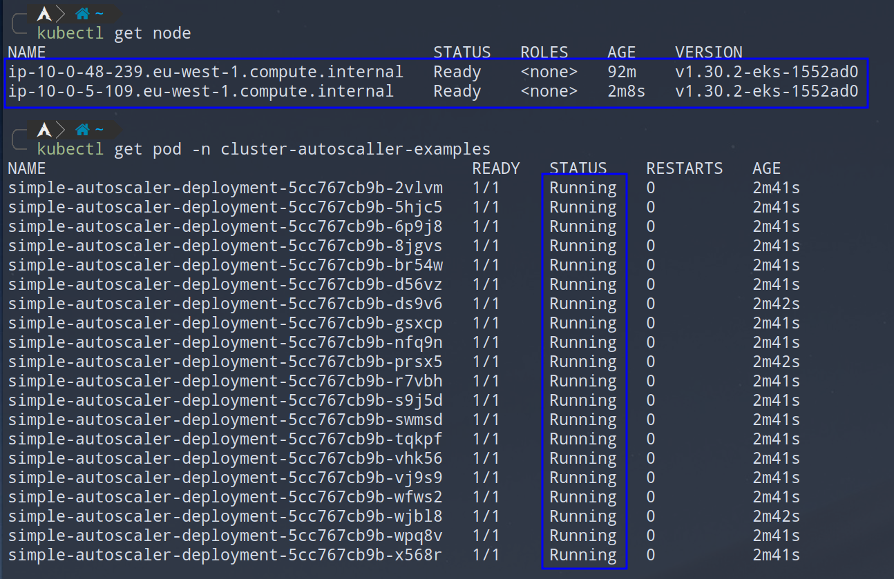

# Cluster Autoscaler Examples

Deploy examples with `kubectl apply -f .`.
All examples are deployed in `cluster-autoscaler-examples` namespace.

## Simple autoscaler

Simple deployment with 20 pods.

After deploying resources some of the pods will be in pending state, and that will trigger scale up event for cluster autoscaler.
After a couple of minutes new node will be added to your worker nodes and remaining pods will be scheduled on the new node.

Delete the resources and wait for 10 min for the scale down event to trigger, reducing number of worker nodes to their original size.
