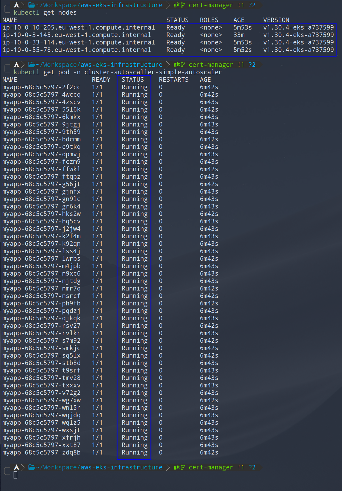

# Cluster Autoscaler Examples

Examples that demonstrate worker node scaling with cluster autoscaler.
For more information see [link](./README.md#cluster-autoscaler)

Deploy examples with `kubectl apply -k .`.

## Simple autoscaler

Simple deployment of 50 pods.

After deploying resources some of the pods will be in pending state, and that will trigger scale up event for cluster autoscaler.
After a couple of minutes new node will be added to your worker nodes and remaining pods will be scheduled on the new node.

Resources are deployed to `cluster-autoscaller-simple-autoscaler` namespace.

    

    <em>Fig. Cluster autoscaler preparing to scale</em>

    

    <em>Fig. Cluster autoscaler, scaling complete</em>

Delete the resources and wait for 10 min for the scale down event to trigger, reducing number of worker nodes to their original size.
