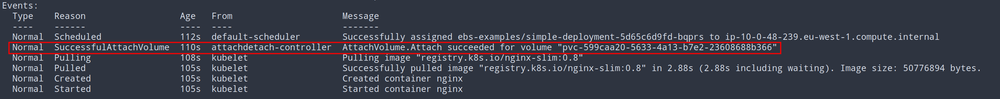

# Elastic Block Storage Examples

Examples with persistent storage backed by ebs volumes.
For more informatio see [link](/README.md#ebs-csi-driver)

Deploy examples with `kubectl apply -k .`.

## Simple Ebs

Dynamic allocation of ebs storage with pvc to one pod.
Resources are deployed to `ebs-example-simple-ebs` namespace.

Check that the pod is running and that volume is successfully attached.

CHANGE IMAGE

## Failed Mount

Ebs volumes are `ReadWriteOnce` and only one pod can mount the volume.
When trying to mount the volume in multiple pods, pods will remain in `Failed` state.

Resources are deployed in `ebs-example-failed-mount` namespace.

ADD IMAGE
