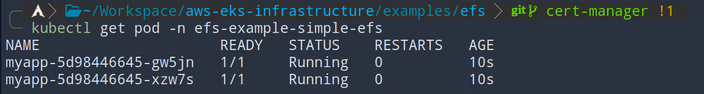

# Elastic File System Storage Examples

Deploy examples with `kubectl apply -f .`.
All examples are deployed in `efs-examples` namespace.

## Simple efs

Mounting efs storage with pvc on multiple pods.
Efs volumes support `ReadWriteMany` and can be mounted on multiple pods at the same time.

Check that the pod is running and that volume is successfully attached.

