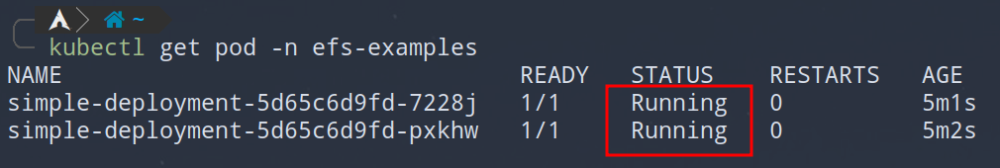

# External Dns

Examples with external dns controller for managing dns entries in route 53.
For more information see [link](./README.md#external-dns)

Deploy examples with `kubectl apply -k .`.

## Simple Dns

Demonstrating dns updates for the service of type `LoadBalancer`.
Be sure to change hostname in the `Service` object to your own hostname.

Resources are deployed in `external-dns-example-simple-dns` namespace.

Check that you can resolve dns entry.

    

    <em>Fig. External dns, simple example</em>

