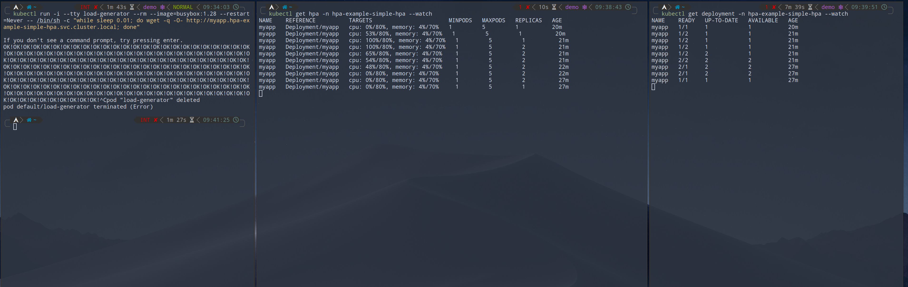

# Horizontal Pod Autoscaler

Horizontal pod autoscaler is used to scale applications horizontally.
It uses resource requests (not limits) to scale pods and needs metrics to scale the application.

If you use ArgoCD be sure to not refine number of replicas in the manifests to avoid race conditions.


Prepare shells for monitoring.
```bash
# shell 1: watch number of pods
kubectl get deployment -n hpa-example-simple-hpa --watch

# shell 2; watch horizontal pod autoscaler metrics
kubectl get hpa -n hpa-example-simple-hpa --watch
```

To trigger the auto scaling event execute the following command.
```bash
kubectl run -i --tty load-generator --rm --image=busybox:1.28 --restart=Never -- /bin/sh -c "while sleep 0.01; do wget -q -O- http://myapp.hpa-example-simple-hpa.svc.cluster.local; done"
```

After the load reduces pods will scale down in 5-10 minutes.


