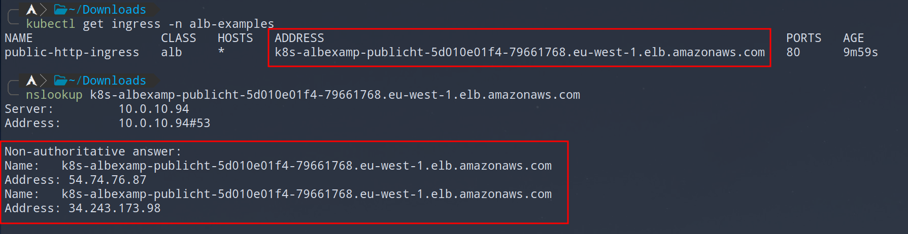

# Load Balancer Controller

Deploy examples with `kubectl apply -f .`.
Wait a couple of minutes for load balancer to get in the `Active` state looking in the aws console.
All examples are deployed in `lbc-examples` namespace.

## Network load balancer

With service type of `LoadBalancer`, network load balancer is deployed.
To have encrypted traffic in the cluster you need to deploy ingress in the cluster like `nginx`.

Use `pi` target type where target group for load balancer is the pod ip address.

Wait for the load balancer to be deployed and in ready state.

```bash
kubectl get vsc -n lbc-examples
```

Test if the dns is resolving ok.

```bash
nslookup ENDPOINT
```

Test if you can connect to the service from your computer.

```bash
curl -i http://ENDPOINT:80
```

## Ingress

When you create ingress rule of class `alb`, application load balancer is created.

For every ingress you get one application load balancer and that can become costly.
To prevent this use ingress groups or use ingress in the cluster with nlb that passes the traffic.

Use `ip` target type to route directly to the ip address of the pods.


Get ingress public address and check that it is resolving ok.



Check that you can access the service in web browser or using

```bash
curl -i --header "Host: test.lukak.com" http://ENDPOINT:80
```

## Ingress with TLS

This example is commented out since there are a lot assumptions abou the aws environment.

How to test the example:
1. Create certificate with "Certificate Manager" on aws.
2. Deploy the example.
3. Check if the load balancer is in `Ready` state
4. Add `CNAME` record in Route 53 with target application load balancer endpoint value
5. Wait for a couple of minutes until dns is propagated

Check if the dns resolves ok.
```bash
nslookup DNS-NAME
```

Check if you can hit the pod.
```bash
curl -i https://DNS-NAME:80
```

For application load balancers you need the certificate from certificate manager.
Use "Let's Encrypt" if the reverse proxy is deployed in the cluster.

Tls is terminated at the load balancer and ingress definition does not have tls section since there is no need to keep certificate and the key in the kubernetes.

